# LoraBot
LoraBot - Tool for analyzing activity in chatbots (Telegram, Slack, Discord, Vk, WhatsApp, Viber and all other) 
created in Python.<br/>
<br/>
## Project structure
- lorabot directory with code that will help you in your analytics
- docker-compose.yml for create database for analytics near your Project
- .env stores credentials for accessing analytics to the database and a password for accessing analytics from the bot
- *_bot.py with embedded analytics  (pay attention to telegram_bot.py, there are the most examples)
## How add analytics to your project 
1) First of all, you need to download LoraBot as zip or using git:
    ```bash
    git clone https://github.com/aleksspevak/lorabot.git
    ``` 
    and put near your bot.
2) Create postgresql database for LoraBot by running the following command  
   ```bash
   docker-compose up -d
   ``` 
   and put database near your bot. If you don't have docker-compose installed, you can read how to install here:
   https://docs.docker.com/compose/install/
3) Install the libraries, that need for LoraBot:
   ```bash
   pip3 install -r requirements.txt
   ```
4) Set password for accessing analytics in .env file:
   ```docker
   ANALYTICS_PASSWORD=lorabot
   ``` 
5) Initialize LoraBot in your bot:
   ```python
   from lorabot import LoraBot
   lora_bot = LoraBot("your bot's name")
   ``` 
6) Set where you need LoraBot functions, to start getting information for analytics as in examples:
   ```python
   #to track new users, for example, in a telegram, it is appropriate to put a function in the processing functions of the /start command
   lora_bot.user(USER_ID)
   #to track commands, menu messages, messages
   lora_bot.message(TEXT, TEXT_TYPE, USER_ID)
   #to track events
   lora_bot.event(EVENT, EVENT_TYPE, USER_ID)
   #to track review 
   lora_bot.review(REVIEW, USER_ID)
   #to track bot assessment
   lora_bot.assessment(RATING_IN_INT_FORMAT, USER_ID)
   ``` 
   Great! Now you get analytics from your bot. 
7) To get analytics, make some kind of conditional branching, for example in a file telegram_bot.py a condition has been made to receive a message with a keyword, after that the password is checked and after that the bot owner gets access to analytics:<br/>
   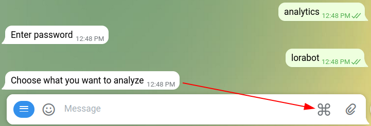<br/>
   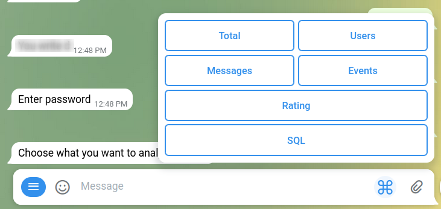<br/>
## How use another PostgreSQL database
If you have your own database or want to deploy it in the cloud as a SaaS, you need to create a user yourself, run the create_tables.sql file and put credentials in the .env file.
## Analytics metrics
Below describe all functions for analytic in LoraBot.<br/>
Notice that some function has parameters to set period of analytics,volume of returning data or to set message/event type. 
You can learn more about parametrs on function's documentation.<br/>
Also some functions return only text information, but there are functions that return photo and text information.<br/>
Here some examples how return information from analytics in telegram bot:
```python
#Return total information of users that using your bot(only text)
info = lora_bot.analyze_total(START_PERIOD, END_PERIOD)
bot.send_message(message.chat.id, info)
#Return information about daily active users(photo+text)
photo, info = lora_bot.analyze_dau(START_PERIOD, END_PERIOD)
bot.send_message(message.chat.id, info)
bot.send_photo(message.chat.id, photo)
``` 
### Parametrs for metrics
*period_start* - beginning of the analysis period<br/>
*period_end* - end of the analysis period<br/>
*message_type* - type of message from the user<br/>
*event_type* - type of event from the user<br/>
*messages_for_funnel* - array of messages in right order for funnel<br/>
*events_for_funnel* - array of events in right order for funnel<br/>
*volume* - amount of data to show<br/>
### Total metrics
\#1 **analyze_total** - Return total information about your users, their messages and events.<br/>
*Parametrs:* period_start, period_end.<br/>
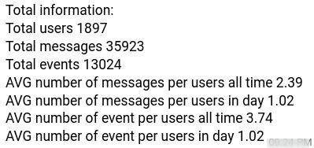<br/>
### Users metrics
\#2 **analyze_user_number_accumulation** - Analyzes number of users with accumulation<br/>
*Parametrs:* period_start, period_end.<br/>
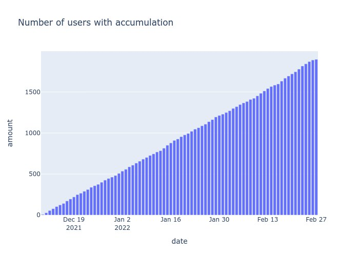<br/>
\#3 **analyze_new_user** - Analyzes number of new registered users<br/>
*Parametrs:* period_start, period_end.<br/>
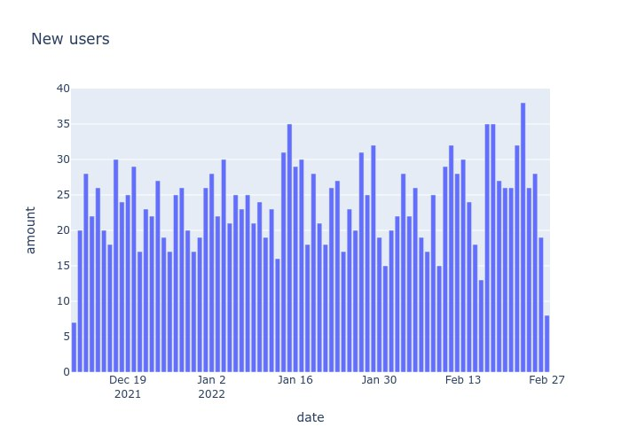<br/>
\#4 **analyze_hour_activity** - Analyzes number of message by hours activity<br/>
*Parametrs:* period_start, period_end.<br/>
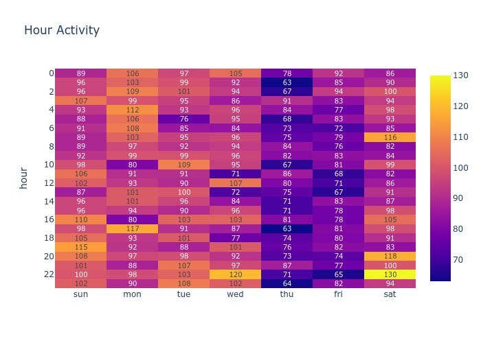<br/>
\#5 **analyze_dau** - Analyzes number of active users by days<br/>
*Parametrs:* period_start, period_end.<br/>
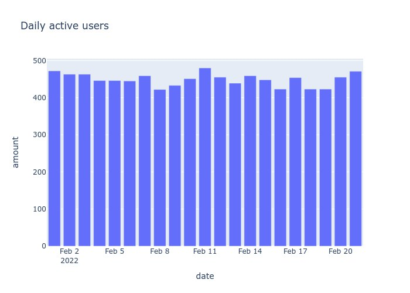<br/>
\#6 **analyze_wau** - Analyzes number of active users by weeks<br/>
*Parametrs:* period_start, period_end.<br/>
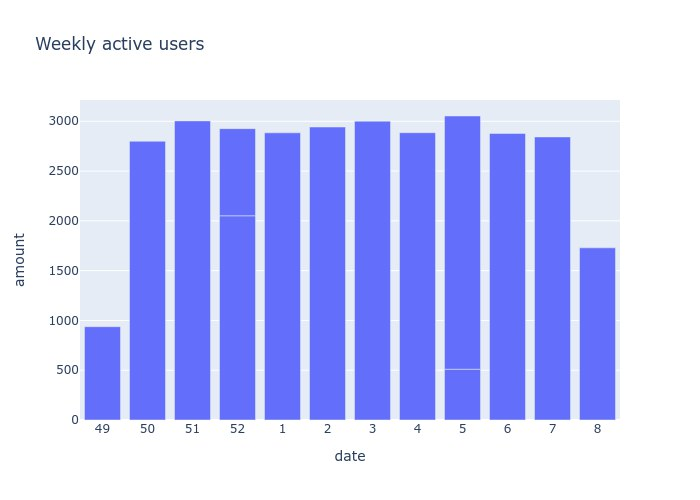<br/>
\#7 **analyze_mau** - Analyzes number of active users by month<br/>
*Parametrs:* period_start, period_end.<br/>
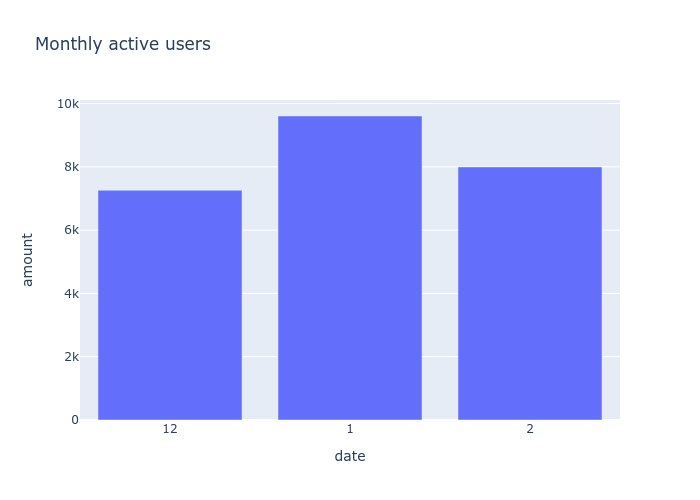<br/>
\#8 **analyze_yau** - Analyzes number of active users by year<br/>
*Parametrs:* period_start, period_end.<br/>
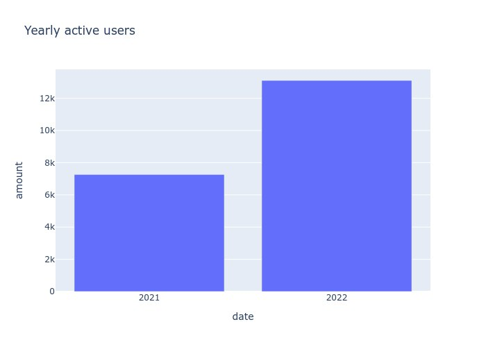
### Messages metrics
\#9 **analyze_messages_number** - Analyzes number of messages by days.<br/>
*Parametrs:* period_start, period_end, message_type.<br/>
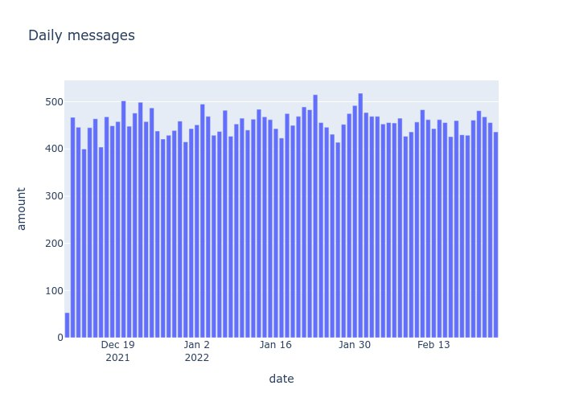<br/>
\#10 **analyze_messages** - Return messages.<br/>
*Parametrs:* period_start, period_end, message_type, volume.<br/>
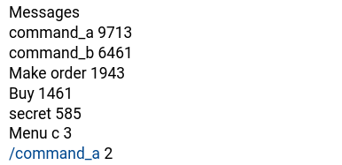<br/>
\#11 **analyze_messages_type** - Analyzes messages by types.<br/>
*Parametrs:* period_start, period_end.<br/>
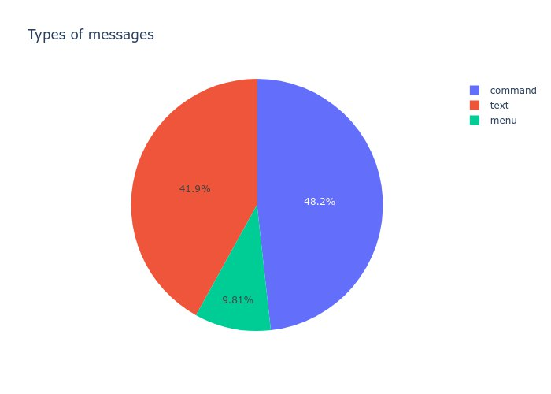<br/>
\#12 **analyze_messages_funnel** - Create funnel for messages.<br/>
*Parametrs:* messages_for_funnel, period_start, period_end.<br/>
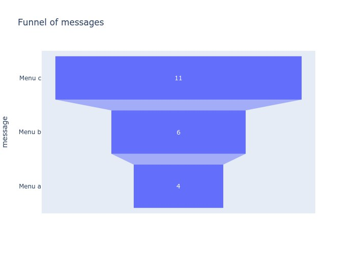<br/>
### Events metrics
\#13 **analyze_events_number** - Analyzes number of events by days.<br/>
*Parametrs:* period_start, period_end, event_type.<br/>
<br/>
\#14 **analyze_events** - Return events.<br/>
*Parametrs:* period_start, period_end, event_type, volume.<br/>
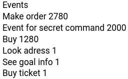<br/>
\#15 **analyze_events_type** - Analyzes events by types.<br/>
*Parametrs:* period_start, period_end.<br/>
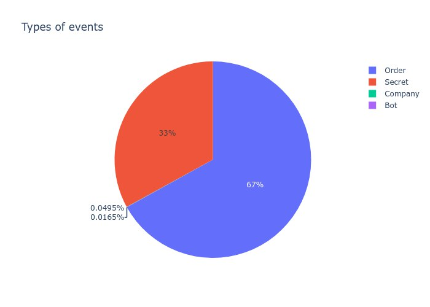<br/>
\#16 **analyze_events_funnel** - Create funnel for events.<br/>
*Parametrs:* events_for_funnel, period_start, period_end.<br/>
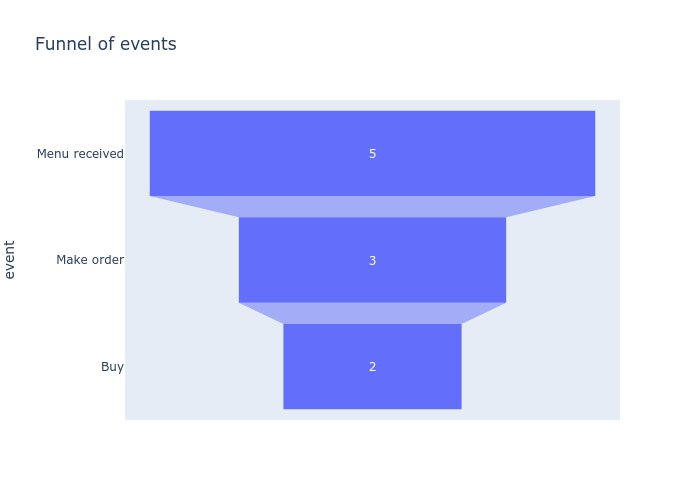<br/>
### Assessment and review metrics
\#17 **analyze_assessment** - Analyzes assessment.<br/>
*Parametrs:* period_start, period_end.<br/>
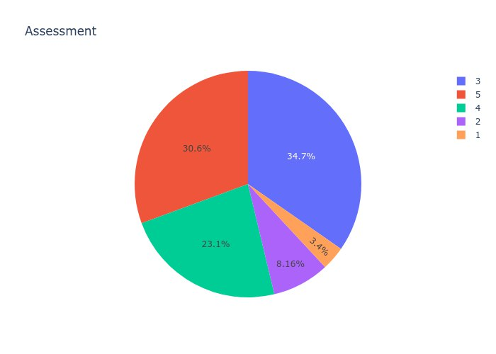<br/>
\#18 **analyze_review** - Return reviews.<br/>
*Parametrs:* period_start, period_end, volume.<br/>
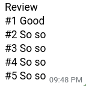<br/>
### Other metrics
\#19 **analyze_language** - Analyzes what language users use.<br/>
*Parametrs:* period_start, period_end.<br/>
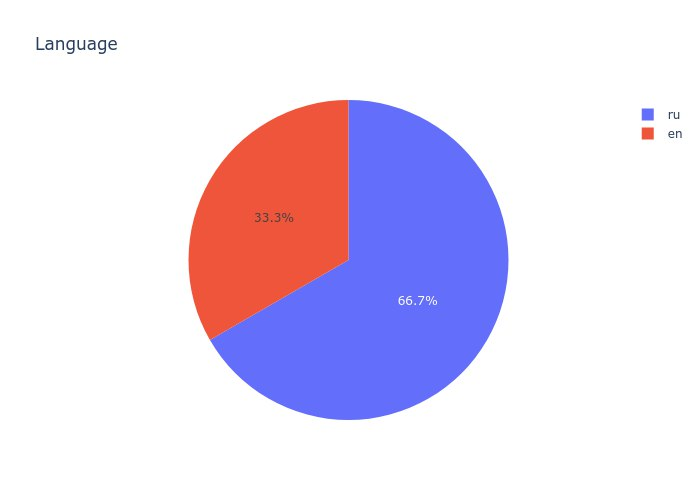<br/>
\#20 **analyze_bots_users** - Analyzes number of users in all bots.<br/>
*Parametrs:* No.<br/>
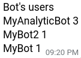<br/>

## How create custom metrics
There is a function to which you can pass an SQL query directly from the bot or put your query in it. This is **sql_query** function and it accepts only one parameter - a query.<br/>
```python
   info = lora_bot.sql_query(YOUR_SQL)
   bot.send_message(message.chat.id, info, reply_markup=your_markup)
```
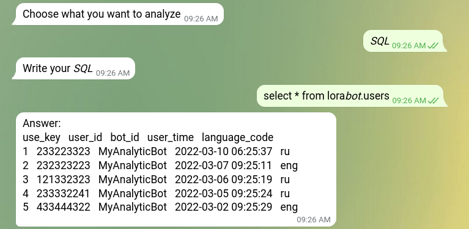<br/>
<br/>
Database schema where information on users, messages, events and reviews is stored:<br/>
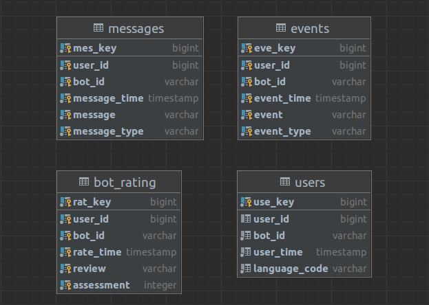<br/>

Enjoy!
